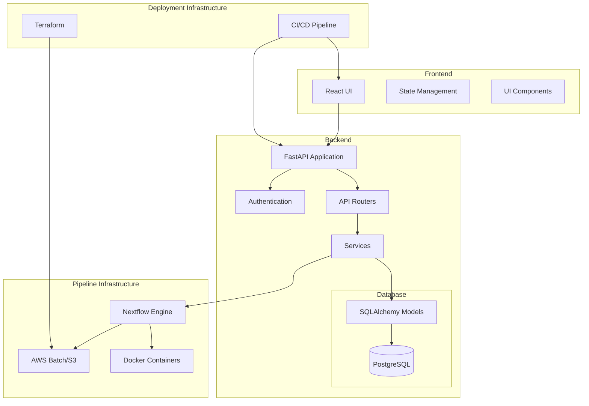
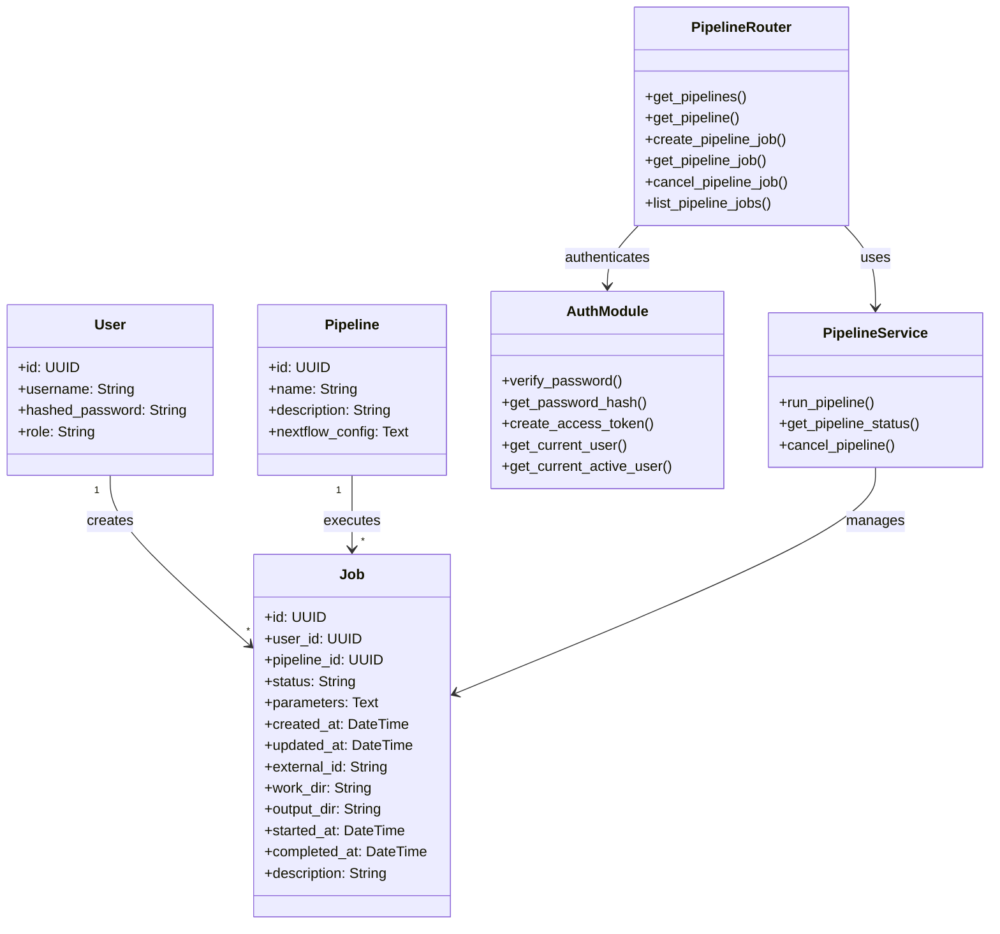
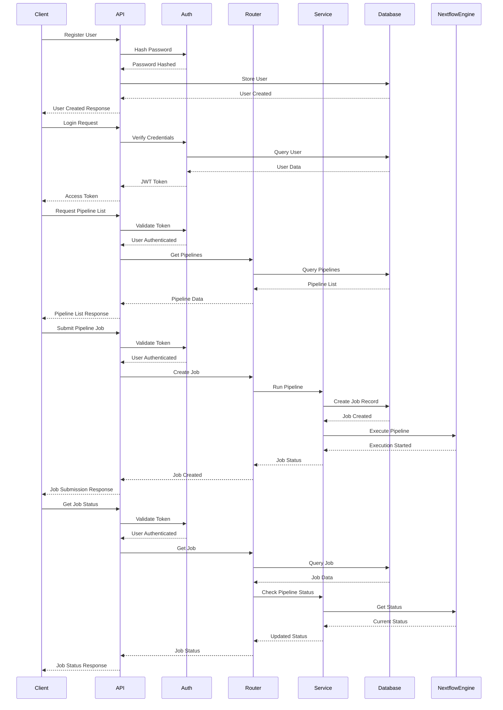
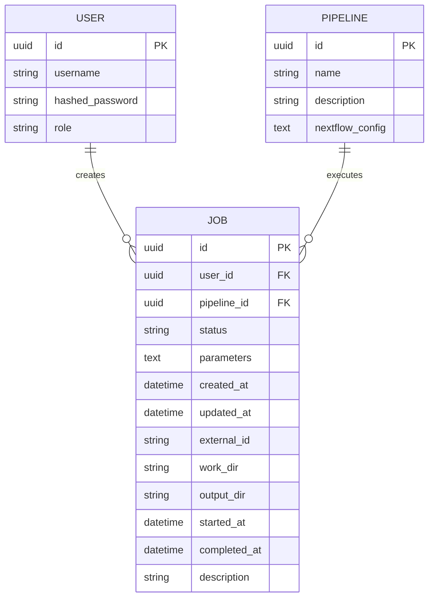
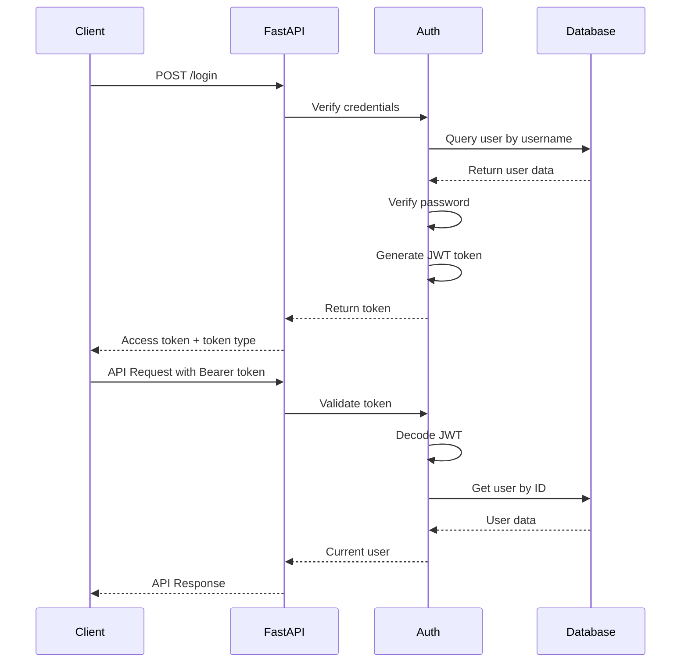
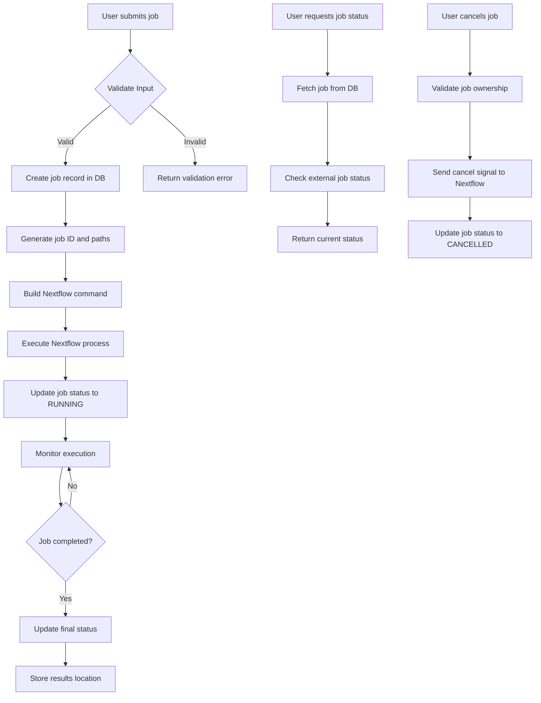

# Nextflow Pipeline Platform Architecture

This document provides a comprehensive overview of the Nextflow Pipeline Platform architecture using Mermaid diagrams.

## System Architecture

## Component Relationship Diagram

## API Flow Diagram

## Database Schema

## Authentication Flow

## Pipeline Execution Flow

