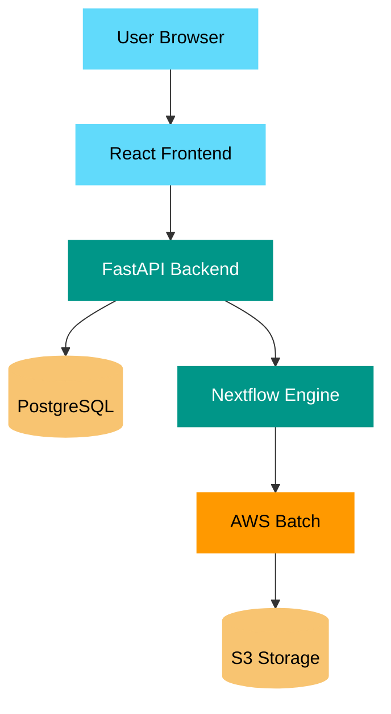

```mermaid
graph TD
    User[User Browser] --> Frontend[React Frontend]
    Frontend --> API[FastAPI Backend]
    API --> DB[(PostgreSQL)]
    API --> NF[Nextflow Engine]
    NF --> AWS[AWS Batch]
    AWS --> S3[(S3 Storage)]
    
    classDef frontend fill:#61DAFB,stroke:#61DAFB,color:#000000
    classDef backend fill:#009688,stroke:#009688,color:#FFFFFF
    classDef database fill:#F8C471,stroke:#F8C471,color:#000000
    classDef aws fill:#FF9900,stroke:#FF9900,color:#000000
    
    class User,Frontend frontend
    class API,NF backend
    class DB,S3 database
    class AWS aws
```
